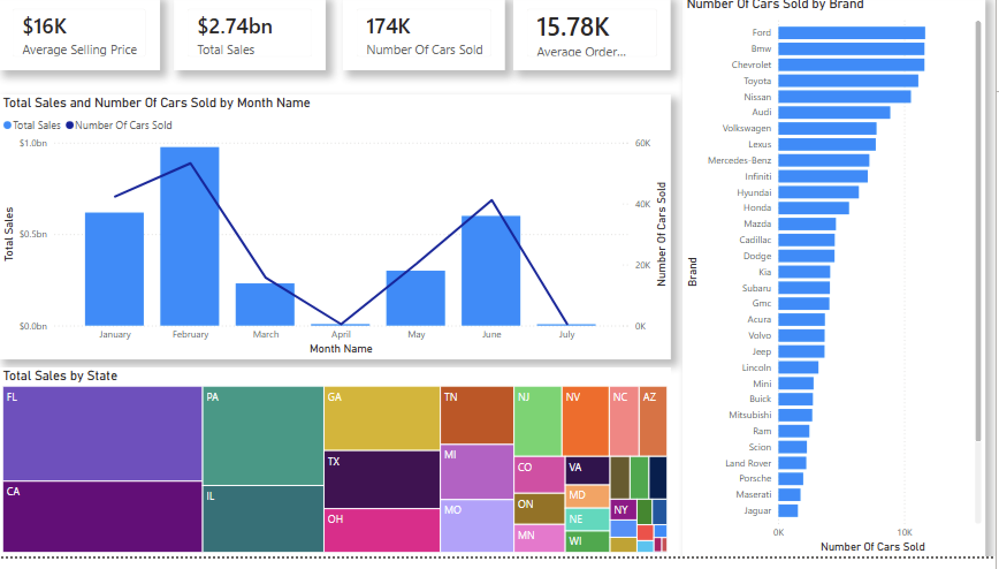

🚗 Car Sales Dashboard – Power BI (Beginner Project)

This dashboard provides insights into car sales across various states, brands, and months.
Created using Power BI as part of my learning journey.

🔹 Features

KPIs: Total Sales, Avg Selling Price, Total Orders

Month-wise Sales Trend

Brand Performance Analysis

State-wise Revenue Treemap

Interactive slicers

🔧 Tools Used

Power BI

Power Query

DAX
